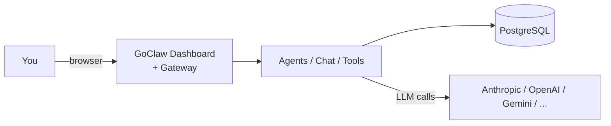
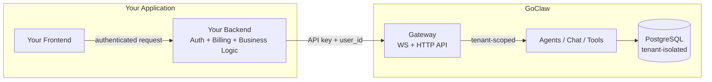
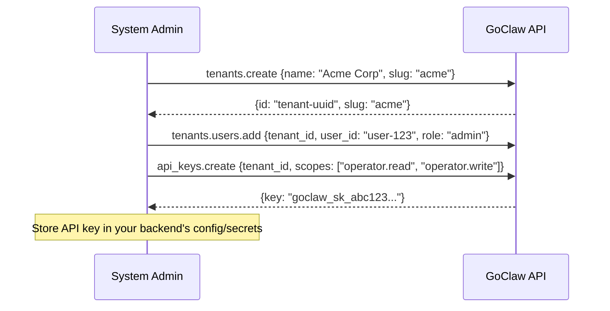
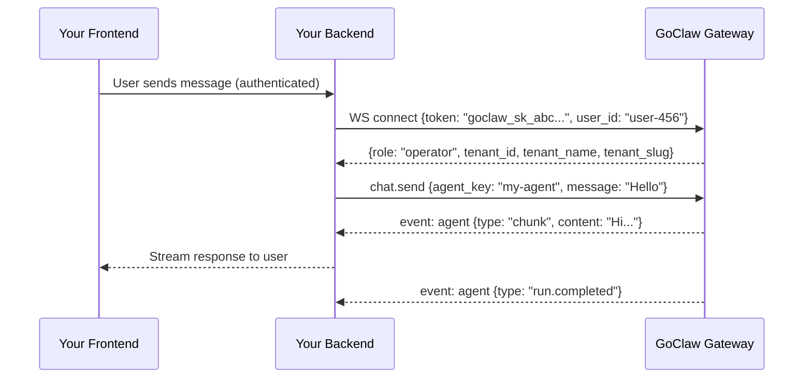
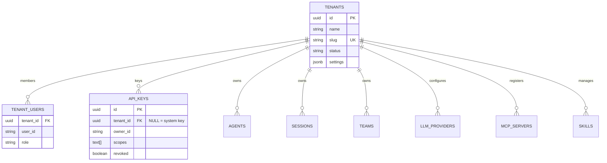

# Multi-Tenant Integration Guide

GoClaw is an **AI agent gateway** — it handles agents, chat, sessions, tools, MCP servers, and memory. It supports two deployment modes:

1. **Personal / Single-tenant** — Use GoClaw directly as your AI backend. Built-in dashboard included.
2. **SaaS / Multi-tenant** — Integrate GoClaw behind your application. API keys bridge the two systems.

---

## Deployment Modes

### Mode 1: Personal Use (Single-Tenant)

Use GoClaw as a standalone AI backend with its built-in web dashboard. No separate frontend or backend needed.



**How it works:**
- Log in with the gateway token via the built-in web dashboard
- Create agents, configure LLM providers, chat — all from the dashboard
- Connect chat channels (Telegram, Discord, etc.) for messaging
- All data lives under the default "master" tenant — no tenant config needed

**Setup:**

```bash
# 1. Build and onboard
go build -o goclaw . && ./goclaw onboard

# 2. Start the gateway
source .env.local && ./goclaw

# 3. Open dashboard at http://localhost:3777
#    Log in with your gateway token + user ID "system"
```

**When to use:** Personal AI assistant, small team, self-hosted AI tools, development/testing.

**Scaling up:** When you need multiple isolated environments (clients, departments, projects), create additional tenants. Multi-tenant features activate automatically — no migration needed.

---

### Mode 2: SaaS Integration (Multi-Tenant)

Integrate GoClaw as the AI engine behind your SaaS application. Your app handles auth, billing, and UI. GoClaw handles AI.



**How it works:**
- Your **frontend never talks to GoClaw directly**
- All requests go through **your backend**, which authenticates the user, then calls GoClaw using a **tenant-bound API key**
- The API key stays server-side — never exposed to the browser
- GoClaw automatically scopes all data to the tenant bound to that API key

**When to use:** SaaS products with AI features, multi-client platforms, white-label AI solutions.

---

## Tenant Setup (Multi-Tenant Only)



Each tenant gets isolated: **agents, sessions, teams, memory, LLM providers, MCP servers, skills**. A tenant-bound API key automatically scopes every request — no extra headers needed.

---

## Tenant Resolution

GoClaw determines the tenant from the credentials used to connect:

| Credential | Tenant Resolution | Use Case |
|------------|-------------------|----------|
| **Gateway token** + owner user ID | All tenants (cross-tenant) | System administration |
| **Gateway token** + non-owner user ID | User's tenant membership | Dashboard users |
| **API key** (tenant-bound) | Auto from key's `tenant_id` | Normal SaaS integration |
| **API key** (system-level) + `X-GoClaw-Tenant-Id` | Header value (UUID or slug) | Cross-tenant admin tools |
| **Browser pairing** | Paired tenant | Dashboard operators |
| **No credentials** | Master tenant | Dev/single-user mode |

**Owner IDs:** Configured via `GOCLAW_OWNER_IDS` env var (comma-separated). Only owners get cross-tenant access with the gateway token. Default: `system`.

**Recommended for SaaS**: Use **tenant-bound API keys**. The tenant is resolved automatically from the key — your backend doesn't need to send any tenant header.

---

## HTTP API

All HTTP endpoints accept standard headers:

| Header | Required | Description |
|--------|:---:|-------------|
| `Authorization` | Yes | `Bearer <api-key-or-gateway-token>` |
| `X-GoClaw-User-Id` | Yes | Your app's user ID (max 255 chars). Scopes sessions and per-user data |
| `X-GoClaw-Tenant-Id` | No | Tenant UUID or slug. Only needed for system-level keys |
| `X-GoClaw-Agent-Id` | No | Target agent ID (alternative to `model` field) |
| `Accept-Language` | No | Locale for error messages: `en`, `vi`, `zh` |

### Chat (OpenAI-Compatible)

```bash
curl -X POST https://goclaw.example.com/v1/chat/completions \
  -H "Authorization: Bearer goclaw_sk_abc123..." \
  -H "X-GoClaw-User-Id: user-456" \
  -H "Content-Type: application/json" \
  -d '{
    "model": "agent:my-agent",
    "messages": [{"role": "user", "content": "Hello"}]
  }'
```

The `model` field uses `agent:<agent-key>` format. The API key is bound to tenant "Acme Corp" — the response only includes data from that tenant.

### List Resources

```bash
# List agents
curl https://goclaw.example.com/v1/agents \
  -H "Authorization: Bearer goclaw_sk_abc123..." \
  -H "X-GoClaw-User-Id: user-456"

# List sessions
curl https://goclaw.example.com/v1/sessions \
  -H "Authorization: Bearer goclaw_sk_abc123..." \
  -H "X-GoClaw-User-Id: user-456"
```

### System Admin (Cross-Tenant)

```bash
# List agents for a specific tenant (requires gateway token + owner user ID)
curl https://goclaw.example.com/v1/agents \
  -H "Authorization: Bearer $GATEWAY_TOKEN" \
  -H "X-GoClaw-Tenant-Id: acme" \
  -H "X-GoClaw-User-Id: system"
```

---

## WebSocket Integration

For real-time features (streaming chat, live events), connect via WebSocket:



After `connect`, **all methods are auto-scoped** to the API key's tenant. Events are server-side filtered — your backend only receives events belonging to its tenant.

**Protocol**: Frame types `req` (client→server), `res` (server→client), `event` (async push). Protocol version 3.

---

## Chat Channels

Chat channels (Telegram, Discord, Zalo, Slack, WhatsApp, Feishu) connect to GoClaw as **channel instances**. Each instance is configured with a `tenant_id` — messages from that channel are automatically resolved to the correct tenant.

No API key or header is needed for channel-based interactions. The tenant is determined by the channel instance configuration at setup time.

---

## API Key Scopes

API keys use scopes to control access level:

| Scope | Role | Permissions |
|-------|------|-------------|
| `operator.admin` | admin | Full access — agents, config, API keys, tenants |
| `operator.read` | viewer | Read-only — list agents, sessions, configs |
| `operator.write` | operator | Read + write — chat, create sessions, manage agents |
| `operator.approvals` | operator | Approve/reject execution requests |
| `operator.provision` | operator | Create tenants + manage tenant users |
| `operator.pairing` | operator | Manage device pairing |

A key with `["operator.read", "operator.write"]` gets `operator` role. A key with `["operator.admin"]` gets `admin` role.

---

## Per-Tenant Overrides

Tenants can customize their environment without affecting other tenants:

| Feature | Scope | How |
|---------|-------|-----|
| **LLM Providers** | Per-tenant provider configs | Each tenant registers own API keys + models |
| **Builtin Tools** | Enable/disable per tenant | `builtin_tool_tenant_configs` table |
| **Skills** | Enable/disable per tenant | `skill_tenant_configs` table |
| **MCP Servers** | Per-tenant + per-user credentials | Server-level shared, user-level overrides |
| **MCP Require User Credentials** | Per-server setting | `settings.require_user_credentials` — forces per-user API keys |

MCP servers support two credential tiers:
- **Server-level** (shared): configured in the MCP server form, used by all users
- **User-level** (overrides): configured via "My Credentials", per-user API keys merged at runtime (user wins on key collision)

When `require_user_credentials` is enabled, users without personal credentials cannot use that MCP server.

---

## Security

| Concern | How GoClaw Handles It |
|---------|-----------------------|
| API key exposure | Keys stay in your backend — never sent to browser |
| Cross-tenant data access | All SQL queries include `WHERE tenant_id = $N` (fail-closed) |
| Event leakage | Server-side 3-mode filter: unscoped admin, scoped admin, regular user |
| Missing tenant context | Fail-closed: returns error, never unfiltered data |
| API key storage | Keys hashed with SHA-256 at rest; only prefix shown in UI |
| Tenant impersonation | Tenant resolved from API key binding, not client headers |
| Privilege escalation | Role derived from key scopes, not client claims |
| Gateway token abuse | Only configured owner IDs get cross-tenant; others are tenant-scoped |
| System config access | Config page restricted to cross-tenant owners only |
| Logout isolation | Tenant scope cleared from localStorage on logout |

---

## Tenant Data Model



40+ tables carry `tenant_id` with NOT NULL constraint. Exception: `api_keys.tenant_id` is nullable — NULL means system-level cross-tenant key.

**Master tenant** (UUID `0193a5b0-7000-7000-8000-000000000001`): All legacy/default data. Single-tenant deployments use this exclusively.

---

## Environment Variables

| Variable | Default | Description |
|----------|---------|-------------|
| `GOCLAW_OWNER_IDS` | `system` | Comma-separated user IDs with cross-tenant access |
| `GOCLAW_LOG_LEVEL` | `info` | Log level: `debug`, `info`, `warn`, `error` |
| `GOCLAW_CONFIG` | `config.json5` | Path to gateway config file |
